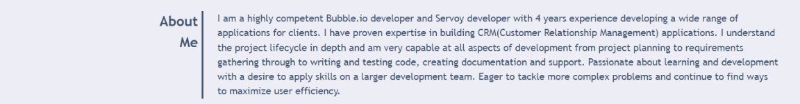

# Portfolio

## Description

This is a portfolio website to show to recuiters, companies and any other people whom I would like to work with about my front end development journey. It consists of About Me, Work and Contact Me sections where visitor can know about myself, see my most recent deployed appliations and contact me via links provided in the footer. It's a fully responsive website and is built with some CSS transition effects that make the website more interesting while user interacts with the it.

 

## Table of Contents

- **[The Breakdown of a Website](#breakdown)**
  - [Header](#breakdown-header)
  - [About Me](#breakdown-about-me)
  - [Work](#breakdown-work)
  - [Contact Me](#breakdown-contact-me)
- [Deployment](#deployment)
- [Authors](#authors)
- [License](#license)

 

## The Breakdown of a Website

### Header

The header consists of my name with profile image on the left and three navigation links on the right. By clicking on the navigation links, user will be navigated to particular content of the website.

 

### About Me

This section highlights my front end development experience, skills, achievements and career objective.

> About Me

### Work

This section shows the most recent front end projects in an image block representation with project title and technologies that is been used for a particular project. Clicking on an image will navigate user to a deployed application in a new tab.

> Work

### Contact Me

This section provies various ways for recruiters and companys to contact me via email or GitHub.

> Contact Me

## Deployment

View my portfolio <a href="https://mingzhao91.github.io/portfolio" target="_blank">here</a>.
 

## Authors

- **Mingzhao Zhou** - <a href="https://github.com/Mingzhao91" target="_blank">Mingzhao91</a>
   

## License

This project is licensed under the MIT License.
